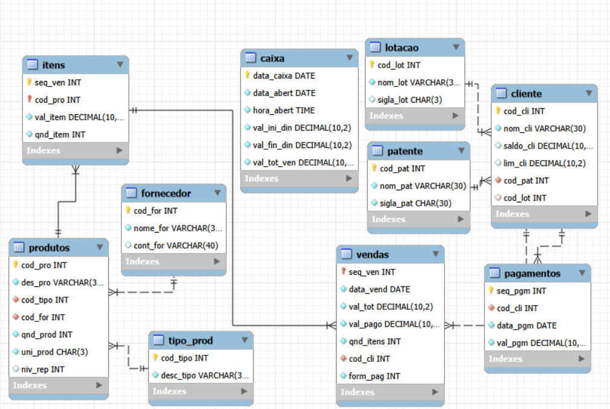

# Banco de Dados – Sistema de Cantina

Este projeto consiste na **modelagem e implementação de um banco de dados relacional** para gerenciamento de uma cantina, contemplando clientes, produtos, fornecedores, vendas, pagamentos e controle de caixa.

---

## Sumário

- [Sobre](#sobre)
- [Primeiros Passos](#primeiros-passos)
- [Como Usar](#como-usar)
- [Tecnologias Utilizadas](#tecnologias-utilizadas)
- [Estrutura do Banco de Dados](#estrutura-do-banco-de-dados)
- [Diagrama Entidade-Relacionamento (DER)](#diagrama-entidade-relacionamento-der)
- [Conceitos Aplicados](#conceitos-aplicados)
- [Dados de Exemplo](#dados-de-exemplo)
- [Possíveis Consultas](#possíveis-consultas)
- [Desenvolvedora](#desenvolvedora)

---

## Sobre

Este repositório contém apenas a **camada de banco de dados** do sistema de cantina.  
Não há interface gráfica ou aplicação backend integrada.

O foco do projeto é demonstrar:
- modelagem de banco de dados relacional
- organização de scripts SQL
- uso correto de chaves primárias e estrangeiras
- criação de consultas para relatórios

---

## Primeiros Passos

### Pré-requisitos
- **MySQL** instalado
- um gerenciador de banco de dados  
  (MySQL Workbench, DBeaver ou phpMyAdmin)

### Passo a passo
1. Clone este repositório  
2. Abra seu gerenciador de banco de dados  
3. Execute o arquivo `schema.sql`  
4. Execute o arquivo `inserts.sql`  
5. Execute o arquivo `queries.sql` para testar as consultas  

---

## Como Usar

Após executar os scripts:
- o banco `cantina` será criado
- as tabelas estarão populadas com dados fictícios
- as consultas estarão prontas para uso

Com o banco você pode:
- gerar relatórios de vendas
- consultar produtos com baixo estoque
- analisar gastos por cliente
- utilizar a estrutura como base para uma aplicação backend

---

## Tecnologias Utilizadas
- **Banco de Dados:** MySQL  
- **Linguagem:** SQL  

---

## Estrutura do Banco de Dados

O banco é composto pelas seguintes tabelas:
- `cliente`
- `patente`
- `lotacao`
- `tipo_prod`
- `fornecedor`
- `produtos`
- `vendas`
- `itens`
- `pagamentos`
- `caixa`

---

## Diagrama Entidade-Relacionamento (DER)

O diagrama abaixo representa a estrutura do banco de dados e os relacionamentos
entre as tabelas do sistema de cantina.

### Principais Relacionamentos
- Um **cliente** pertence a uma **patente** e a uma **lotação**
- Um **produto** pertence a um **tipo** e a um **fornecedor**
- Uma **venda** está associada a um **cliente**
- Uma **venda** possui vários **itens** (relacionamento N:N entre vendas e produtos)
- Um **pagamento** está associado a um **cliente**

---

## Conceitos Aplicados
- Modelagem relacional
- Chaves primárias e estrangeiras
- Relacionamentos 1:N e N:N
- Integridade referencial
- Uso de `auto_increment`
- Tipos numéricos e monetários (`decimal`)

---

## Dados de Exemplo

O projeto inclui **dados fictícios** para:
- clientes
- produtos
- fornecedores
- tipos de produtos
- caixa diário

Esses dados permitem a execução de consultas SQL para análise e testes.

---

## Possíveis Consultas
Exemplos de consultas que podem ser realizadas:
- listar vendas por cliente
- total vendido por dia
- produtos com estoque abaixo do nível de reposição
- clientes com maior volume de compras

---

## Desenvolvedora

 [Emilaine](https://github.com/emilainezx)  
 [Emilaine](https://www.instagram.com/emilainezx/)  
 [Emilaine](https://www.linkedin.com/in/emilaine-bernardo-919150311/)

Projeto desenvolvido com fins **educacionais** e para **portfólio**, demonstrando domínio em SQL e modelagem de banco de dados.
